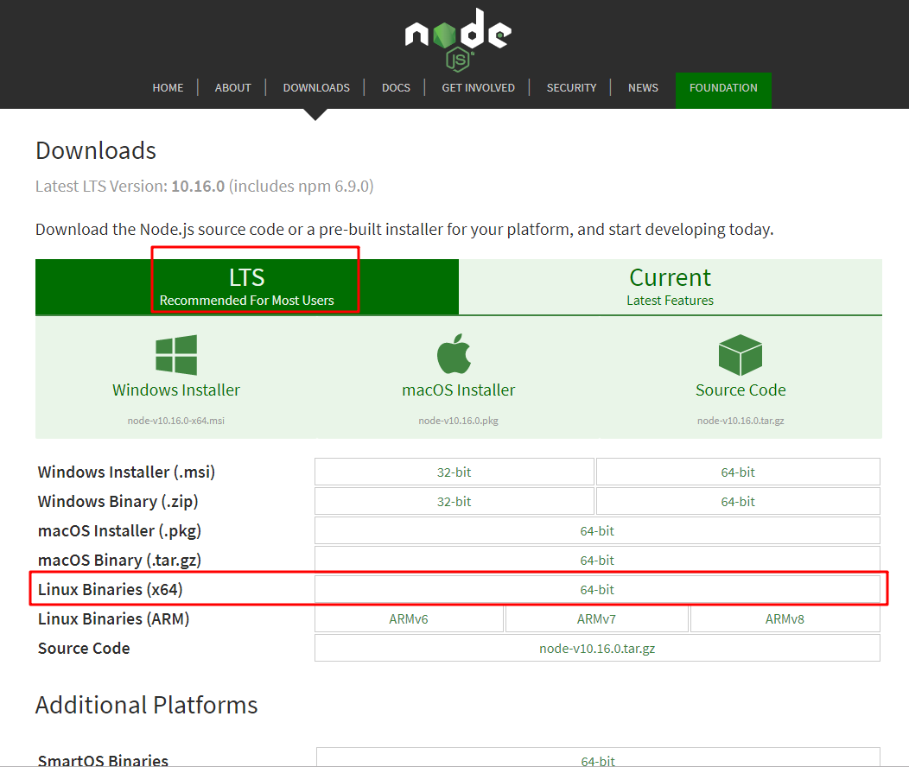

# Centos安装node教程(node版本：v10.16.0)

## 概要
本文描述如何在Centos安装node教程

## 步骤
- 下载最新的node版本（node包含有：node和npm），我们下载编译好的版本，可以直接使用。
```
https://nodejs.org/en/download/
```


- 上传到linux机器，选择自己喜欢的工具（或者：在linux上面直接下载）

- 解压
```
xz -d node-v10.16.0-linux-x64.tar.xz
tar -xvf node-v10.16.0-linux-x64.tar
```

- 移动到系统目录：/usr
```
mv /usr/download/node-v10.16.0-linux-x64 /usr/node-v10.16.0-linux-x64
```

- 创建软连接
```
ln -s /usr/node-v10.16.0-linux-x64/bin/node /usr/local/bin/node
ln -s /usr/node-v10.16.0-linux-x64/bin/npm /usr/local/bin/npm
```

- 验证
```
node -v
npm -v
```


## 总结
- 每个人的环境都是不一样的，总体的逻辑如下：
  - 下载编译后的包
  - 进行解押
  - 创建软连接

## 参考
- [Linux系统（Centos）下安装nodejs并配置环境](https://blog.csdn.net/qq_21794603/article/details/68067821)
- [Linux  安装node运行环境](https://www.jianshu.com/p/5967e37a0a4f)