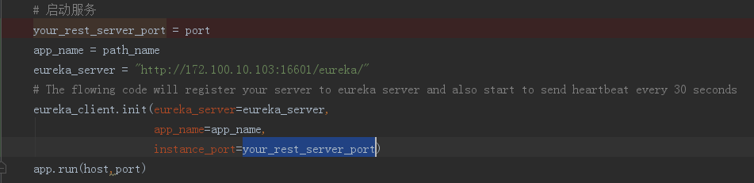
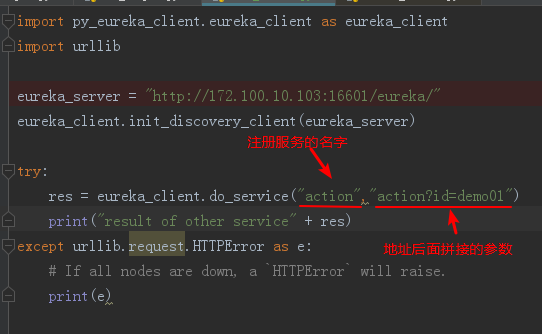

# Flask服务注册Eureka

## 主题
把flask服务注册到Eureka，同时通过获取服务，进行使用

## 需要了解的背景
```
http://www.ityouknow.com/springcloud/2017/05/10/springcloud-eureka.html
```

## 实际操作

### 服务注册：Flask服务注册Eureka


### 服务发现：客户端通过Eureka，获取可以使用的服务


## 其他
- 官方地址：[https://github.com/Netflix/eureka](https://github.com/Netflix/eureka)
- 参考资料：
  - [springcloud(二)：注册中心Eureka](http://www.ityouknow.com/springcloud/2017/05/10/springcloud-eureka.html)
  - [Python的第三方包：py-eureka-client](https://github.com/keijack/python-eureka-client)