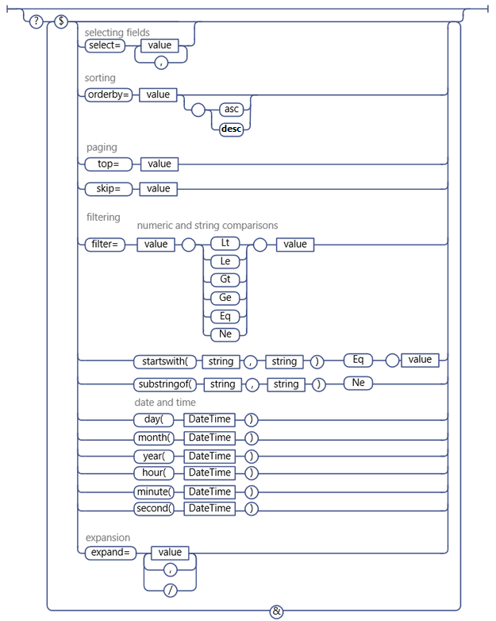

# SharePoint rest 请求的时候，过滤不包含某个字符串

# 主题
描述怎么请求SharePoint的rest接口，过滤不包含某个字符串

# 内容
- 首先查看官方文档，发现支持字符串的操作有：startsWith，substringof，Eq，Ne

- 测试了在substringof，可以使用，后面没有带Eq和Ne

- 一直想不通后面的Eq和Ne怎么使用，测试了很多例子，最后查看到别人说是可以成功的，参考链接2

- 最后发现，官网的图里面Eq和Ne第一个字母是大写的，但是别人成功的例子是小写的eq，最后成功查询

# 参考
- [Use OData query operations in SharePoint REST requests](https://docs.microsoft.com/en-us/sharepoint/dev/sp-add-ins/use-odata-query-operations-in-sharepoint-rest-requests)
- [logical not of substringof() in 2013 REST API](https://sharepoint.stackexchange.com/questions/101266/logical-not-of-substringof-in-2013-rest-api)