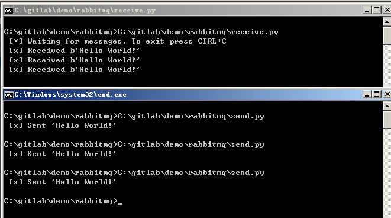

# RabbitMQ学习笔记


## 官网
```
https://www.rabbitmq.com/
```

## docker镜像
```
https://hub.docker.com/_/rabbitmq
```

拉取镜像命令：
```
docker pull rabbitmq
```

## python使用的类库
```
https://pypi.org/project/pika/
```

安装命令：
```
pip install pika
```

## 官方文档地址
```
https://www.rabbitmq.com/documentation.html
```

## 官网例子
- [send.py](send.py)
- [receive.py](receive.py)



## 参考