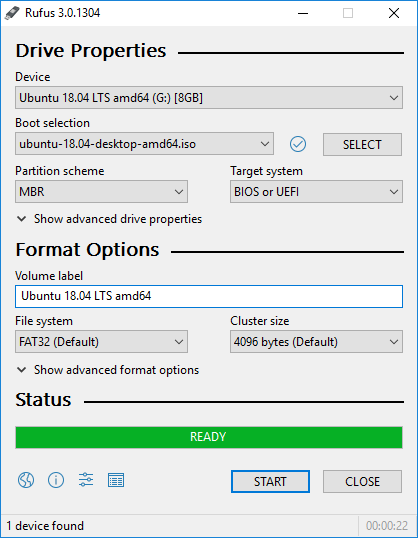

# 个人常用电脑软件（windows版本）

## 压缩
- bandizip
- 官网：https://www.bandisoft.com/bandizip/
- 下载链接：https://www.bandisoft.com/bandizip/dl.php?web

## 快速查看
- QuickLook
- 官网：https://pooi.moe/QuickLook/
- 下载链接：https://github.com/QL-Win/QuickLook/releases

## 快捷启动
- Wox
- 官网：http://www.wox.one/
- 下载链接：https://github.com/Wox-launcher/Wox/releases

## 搜索文件
- Everything
- 官网：https://www.voidtools.com/zh-cn/
- 下载链接：https://www.voidtools.com/zh-cn/downloads/

## 杀毒
- 火绒
- 官网：https://www.huorong.cn/
- 下载链接：https://www.huorong.cn/person5.html

## 文本编辑器
- notepad++
- 官网：https://notepad-plus-plus.org/
- 下载链接：https://notepad-plus-plus.org/downloads/

## 科学上网
- shadowsocks
- 官网：https://shadowsocks.org/en/index.html
- 下载链接：https://github.com/shadowsocks/shadowsocks-windows/releases

## U盘系统制作工具
- rufus
- 官网：http://rufus.ie/
- 下载链接：http://rufus.ie/
- 介绍：[还用不靠谱的Ghost？一款真正良心的装系统神器 - cnbeta](https://www.cnbeta.com/articles/it/900003.htm)

