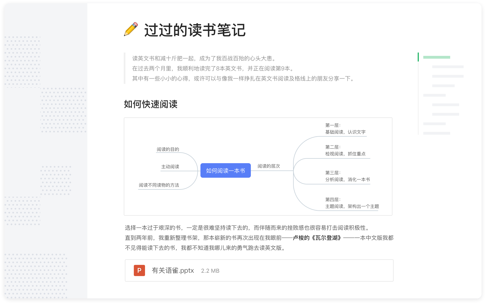

# 杂七杂八的记录

## JupyterLab
> Jupyter Notebook是基于网页的用于交互计算的应用程序。其可被应用于全过程计算：开发、文档编写、运行代码和展示结果。——Jupyter Notebook官方介绍
- 适合程序员用的记笔记的软件
- 官方地址：https://jupyter.org/
- 官方源码地址：https://github.com/jupyterlab/jupyterlab
- 官网使用文档：https://jupyterlab.readthedocs.io/en/stable/
- 其他：
  - 百度百科：https://baike.baidu.com/item/Jupyter/20423051
  - 介绍文档：https://zhuanlan.zhihu.com/p/38612108
- 截屏：

## 语雀
- 介绍：专业的云端知识库。面向个人和团队，提供与众不同的知识管理，打造轻松流畅的工作协同。也是一个记笔记的平台
- 官网：https://www.yuque.com
- 截屏：

## SharePoint
- 获取文件的历史版本的修改者，可以获取下一级的CreatedBy/Title