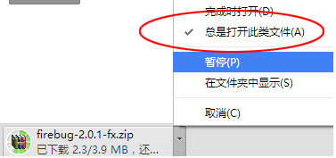
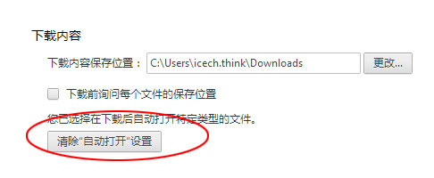

# 清除chrome自动打开下载内容

## 背景
chrome用户可能遇到过，在用Chrome下载文件的时候，不小心误点了“总是打开此类文件”选项，导致每次chrome下载完成后都会弹出窗口自动打开下载的文件，那么chrome下载文件自动打开怎么办？本文我们就来学一下取消chrome总是打开此类文件的方法。

## 解决方法1：勾选掉“总是打开此类文件”
找一个比较大的文件进行下载，在下载过程中，勾选掉“总是打开此类文件”，这样就完美的解决了，简单吧?

## 解决方法2：在chrome设置中清除
如果这种操作不方便，还可以在“设置”里进行修改。在地址栏里面输入“chrome://settings/”，打开设置选项，找到最下方的“显示高新设置...”，点开后可以找到“下载内容”中的“清除自动打开设置”，点击此按钮就可以了。

## 参考
- [Chrome下载文件总是自动打开怎么办 取消Chrome总是打开此类文件](http://www.02405.com/soft/windows/2.html)

## 总结
- 方法1成功解决，方法2没有找到选项（chrome：版本 76.0.3809.100（正式版本） （64 位））
- 解决思路：
  - 通过系统的其他入口进行设置改选项（方法2）
  - 如果上面的路走不通，想想哪里来，就哪里去解决（方法1）