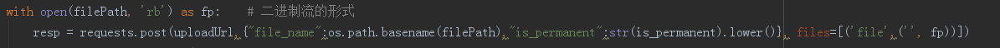

# 致远速联_api接口说明

## 接口：get_file_indicator

### 请求方式
```
post
```

### 输入参数
| 字段名 | 字段类型 | 字段中文名 | 是否必须 | 描述 | 默认值 |
| :--- | :--- | :--- | :--- | :--- | :--- |
| files | list | 文件列表 | 是 | | |
| ServerRelativeUrl | string | 文件SharePoint的相对路径 | 是 | | |
| UIVersionLabel | string | 文件版本号 | 否 | | |

### 输入样例
```json
{
    "para":{
        "files":[
            {
                "ServerRelativeUrl":"/sites/main/DocLib8/定义模板/业务定义/业务分析/标准指标/测试指标计算文件.xlsx",
                "UIVersionLabel":"1.0"
            },
            {
                "ServerRelativeUrl":"/sites/main/DocLib8/定义模板/业务定义/业务分析/标准指标/测试指标计算文件.xlsx"
            }
        ]
    }
}
```

### 输出参数
| 字段名 | 字段类型 | 字段中文名 | 描述 |
| :--- | :--- | :--- | :--- |
| re | int | 返回码 | 0：成功，其他：失败 |
| data | list | 解析的内容 |  |

### 输出样例
```json
{
    "re":0,
    "data":[
        {
            "guid":"0123456789",
            "file_name":"测试指标计算文件.xlsx",
            "sheet_name":"直接指标",
            "指标编码":"CW000100",
            "指标缩写":"ldbl",
            "指标名称":"流动比率指标",
            "计算公式":"流动资产合计/流动负债合计",
            "特征":"资本结构指标",
            "适用主体":"机构",
            "适用维度":"财报期",
            "指标描述（意义）":"反应企业基本财务结构是否稳定",
            "计算编码":""
        },
        {
            "guid":"0123456789",
            "file_name":"测试指标计算文件.xlsx",
            "sheet_name":"直接指标",
            "指标编码":"CW000100",
            "指标缩写":"ldbl",
            "指标名称":"流动比率指标",
            "计算公式":"流动资产合计/流动负债合计",
            "特征":"资本结构指标",
            "适用主体":"机构",
            "适用维度":"财报期",
            "指标描述（意义）":"反应企业基本财务结构是否稳定",
            "计算编码":""
        }
    ]
}
```

## 接口：create_sp_folder

### 请求方式
```
post
```

### 输入参数
| 字段名 | 字段类型 | 字段中文名 | 是否必须 | 描述 | 默认值 |
| :--- | :--- | :--- | :--- | :--- | :--- |
| site | string | 网站名称 | 否 | | 空字符串 |
| path | string | SharePoint文件夹的相对路径 | 是 | | |

### 输入样例
```json
{
    "para":{
        "path":"Doclib8/xuhaozhou"
    }
}
```

### 输出参数
| 字段名 | 字段类型 | 字段中文名 | 描述 |
| :--- | :--- | :--- | :--- |
| re | int | 返回码 | 0：成功，其他：失败 |
| data | list | 解析的内容 |  |

### 输出样例
```json
{
    "re":0,
    "data":{
        "Name":"xuhaozhou",
        "ServerRelativeUrl":"/sites/main/Doclib8/xuhaozhou"
    }
}
```

## 接口：get_sp_files

### 请求方式
```
post
```

### 输入参数
| 字段名 | 字段类型 | 字段中文名 | 是否必须 | 描述 | 默认值 |
| :--- | :--- | :--- | :--- | :--- | :--- |
| site | string | 网站名称 | 否 | | 空字符串 |
| file_path | string | SharePoint文件夹的相对路径 | 是 | | |
| @pageNum | int | 页码 | 否 | | 1 |
| @limit | int | 条数 | 否 | | 10 |
| @sort | dict | 排序 | 否 | | |
| search | string | 名称搜索 | 否 | | |
| type | string | 文件类型 | 否 | | 空字符串 |
| search_reverse | bool | 是否不包含搜索地址 | 否 | 正式环境未上线 | false |
| is_page | bool | 是否分页 | 否 | 正式环境未上线 | true |

### 输入样例
```json
{
    "para":{
        "site":"",
        "file_path":"DocLib8/填报模板/深市上市公司/定期报告/2019SAR",
        "type":"docx",
        "search":"[",
        "@sort":{
            "Name":"asc"
        },
        "search_reverse":true,
        "is_page":false
    }
}
```

### 输出参数
| 字段名 | 字段类型 | 字段中文名 | 描述 |
| :--- | :--- | :--- | :--- |
| re | int | 返回码 | 0：成功，其他：失败 |
| data | list | 解析的内容 |  |
| count | int | 总条数 |  |
| ModifiedBy | string | 修改者 |  |
| Level | string | 状态 | 三种状态：发布，草稿，签出 |
| Name | string | 文件名 |  |
| ServerRelativeUrl | string | SharePoint的相对路径 |  |
| TimeLastModified | string | 最后修改时间 |  |
| UIVersionLabel | string | 版本号 |  |
| GUID | string | 文件的GUID |  |
| ver | string | 入库版本 |  |
| usr | string | 入库人 |  |
| update_time | string | 入库时间 |  |
| uid | string | 入库uid |  |

### 输出样例
```json
{
    "re":0,
    "data":{
        "count":7,
        "data":[
            {
                "ModifiedBy":"陈海娟",
                "Level":"发布",
                "Name":"发布时间+标题+文号（中国证券监督管理委员会-行政许可）.xlsx",
                "ServerRelativeUrl":"/sites/main/DocLib/帮帮采/模板定义/发布时间+标题+文号（中国证券监督管理委员会-行政许可）.xlsx",
                "TimeLastModified":"2019-08-22T06:07:07Z",
                "UIVersionLabel":"1.0",
                "GUID":"jhfkvcjme-dasf23-dfa23-fnkii83423",
                "ver":"",
                "usr":"",
                "update_time":"",
                "uid":""
            },
            {
                "ModifiedBy":"陈海娟",
                "Level":"发布",
                "Name":"公司代码+采取监管措施日期（深圳证券交易所-监管措施）_随机数.xlsx",
                "ServerRelativeUrl":"/sites/main/DocLib/帮帮采/模板定义/公司代码+采取监管措施日期（深圳证券交易所-监管措施）_随机数",
                "TimeLastModified":"2019-08-22T06:07:07Z",
                "UIVersionLabel":"1.0",
                "GUID":"jhfkvcjme-dasf23-dfa23-fnkii83423",
                "ver":"",
                "usr":"",
                "update_time":"",
                "uid":""
            }
        ]
    }
}
```

## 上传文件接口：http://172.100.10.62:3000/u

### 请求方式
```
post
```

### 输入参数
| 字段名 | 字段类型 | 字段中文名 | 是否必须 | 描述 | 默认值 |
| :--- | :--- | :--- | :--- | :--- | :--- |
| file_name | string | 文件名 | 否 | 中文名称（解决requests包无法上传中文文件的情况） | |
| is_permanent | string | 是否用久存储 | 否 | | false |

### 输入其他说明
使用multipart/form-data POST上传文件，文件标识名为：file

### 输入样例
```json
{
    "file_name" : "测试文件.docx",
    "is_permanent" : "false"
}
```

### 输入样例（python-requests）


### 输出参数
| 字段名 | 字段类型 | 字段中文名 | 描述 |
| :--- | :--- | :--- | :--- |
| fileId | string | 文件id | |

### 输出样例
```json
{
    "fileId" : "123456789"
}
```

## 下载文件接口：http://172.100.10.62:3000/d/{fileId}

### 请求方式
```
get
```

### 输入参数
| 字段名 | 字段类型 | 字段中文名 | 是否必须 | 描述 | 默认值 |
| :--- | :--- | :--- | :--- | :--- | :--- |
| fileId | string | 文件ID | 是 | | |

### 输入样例
```
http://172.100.10.62:3000/d/123456789
```

### 输出参数
| 字段名 | 字段类型 | 字段中文名 | 描述 |
| :--- | :--- | :--- | :--- |

### 输出样例
```
文件流
```

## 接口：rptmodal_process

### 请求方式
```
post
```

### 输入参数
| 字段名 | 字段类型 | 字段中文名 | 是否必须 | 描述 | 默认值 |
| :--- | :--- | :--- | :--- | :--- | :--- |
| mid | string | 模板id | 是 | | |
| m | string | 主体 | 是 | | |
| t | string | 时间 | 否 | | |
| context | json | 上下文 | 否 | | |

### 输入样例
```json
{
    "para":{
        "mid":"aaaa",
        "m":"aaaa",
        "t":"aaaa",
        "context":{
        } 
    }
}
```

### 输出参数
| 字段名 | 字段类型 | 字段中文名 | 描述 |
| :--- | :--- | :--- | :--- |
| re | int | 返回码 | 0：成功，其他：失败 |
| data | json | 解析的内容 |  |
| r | bool | 是否转换成功 |  |
| e | string | 信息 |  |
| fileID | string | 文件id |  |
| fileFtpUrl | string | 文件url |  |
| isSuccess | bool | 是否转换成功 |  |

### 输出样例
```json
{
    "re":0,
    "data":{
        "r":true,
        "e":{
            "fileFtpUrl":"http://172.100.10.62:3000/d/abcdefghijklmnopqrstuvwsyz",
            "fileID":"abcdefghijklmnopqrstuvwsyz",
            "isSuccess":true
        }
    }
}
```

### 其他
- 原来的接口名称为：rptmodal_merge

## 接口：get_module_report

### 请求方式
```
post
```

### 输入参数
| 字段名 | 字段类型 | 字段中文名 | 是否必须 | 描述 | 默认值 |
| :--- | :--- | :--- | :--- | :--- | :--- |
| id | string | 主体id | 是 | 非内部主体ID，根据业务场景，接受业务标示，在后台进行转换，转换为内部的主体id | |
| mid | string | 模板id | 是 | 调用的模板 | |
| dt | string | 时间 | 否 | 时间参数，格式为YYYYMMDD | |
| format | string | 格式 | 否 | 0：加水印的pdf，10：word，20，不加水印的pdf，21：不加水印，加密码的pdf，22：加水印，加密码的pdf，30：加水印的jpeg（未实现），31：不加水印的jpeg | "0" |
| context | json | 上下文 | 否 | 额外的上下文信息 | |
| psw | string | 密码 | 否 | | genesysinfo |

### 输入样例
```json
{
    "para":{
        "id":"b123456789",
        "mid":"a123456789",
        "dt":"20190923",
        "format":"0"
    }
}
```

### 输出参数
| 字段名 | 字段类型 | 字段中文名 | 描述 |
| :--- | :--- | :--- | :--- |
| re | int | 返回码 | 0：成功，其他：失败 |
| data | json | 解析的内容 |  |
| code | int | 转换成功代码 | 0为成功 |
| msg | string | 信息 | 描述信息 |
| s_time | string | 时间 | 总体耗时时间，单位为秒 |
| type | string | 返回数据类型 | 上面的format |
| size | bool | 是否转换成功 | 文件大小 |
| data | bool | 是否转换成功 | 文件id |

### 输出样例
```json
{
    "re":0,
    "data":{
        "code":0,
        "msg":"转换成功",
        "s_time":30,
        "type":"0",
        "size":1235654,
        "data":"a123456789"
    }
}
```
