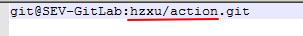
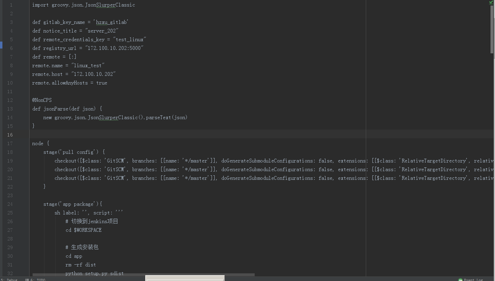
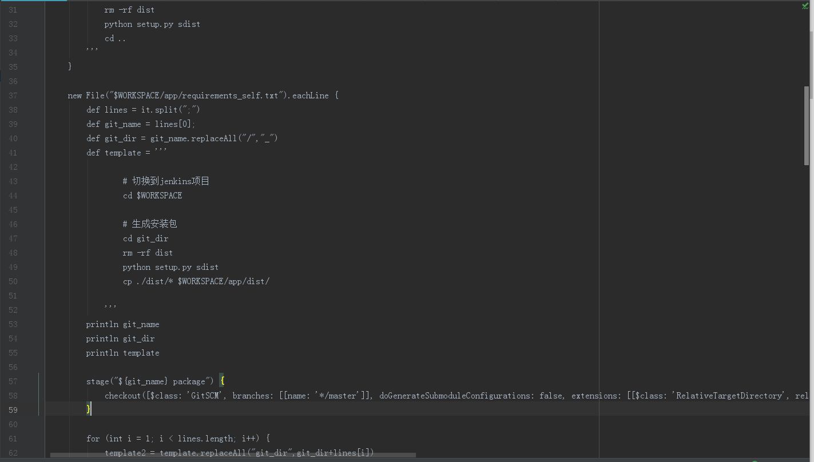
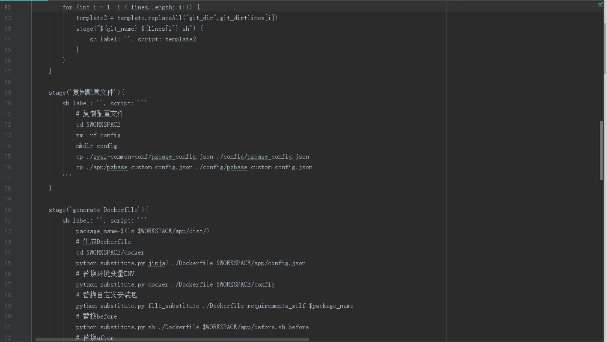
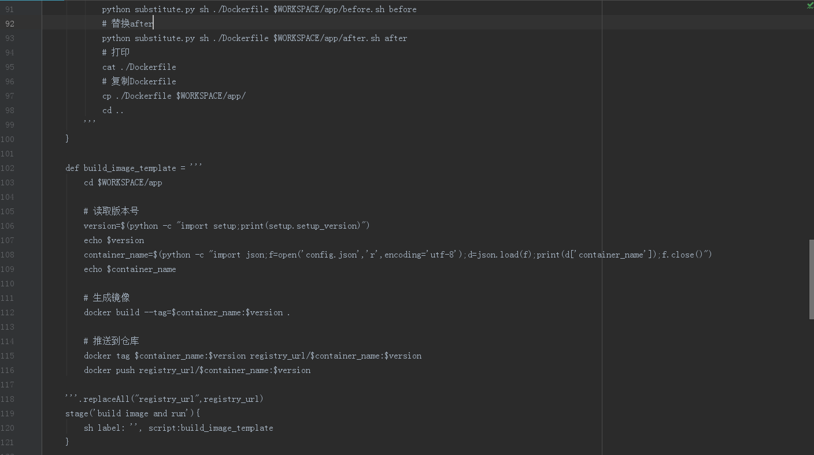
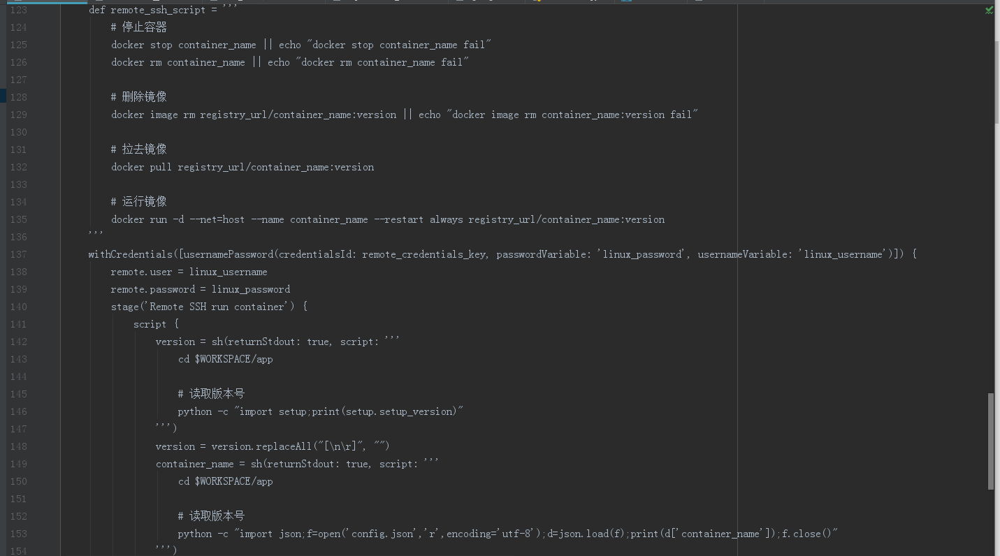
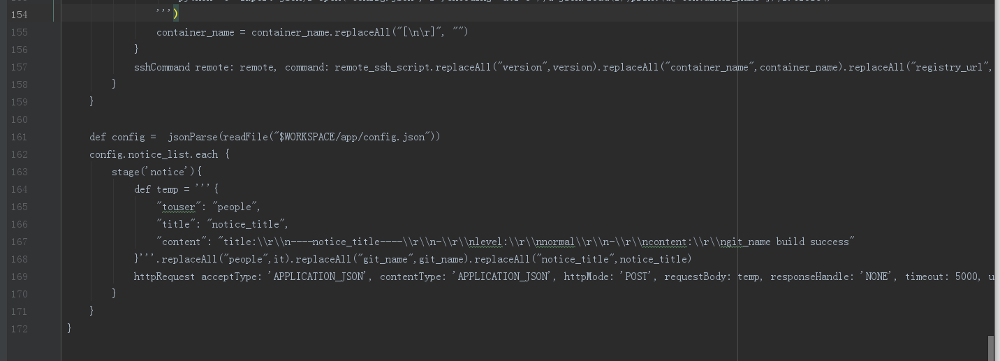
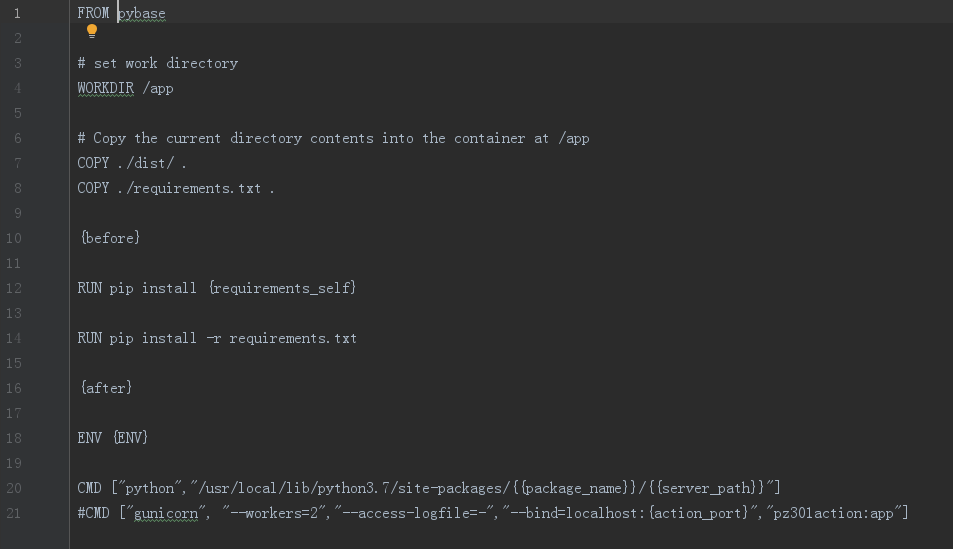

# 致远速联_api服务自动化上线

## 概要
本文档用于描述api服务自动化上线的开发过程，和使用说明

## 大体逻辑
- 通过新建一个Jenkins通用的pipeline，来实现api服务自动化上线docker的全过程。输入参数：gitlab项目名称,例子如下：

- 通过动态获取项目名称，拉取对应的项目，并且根据项目信息，拉取所需要的依赖，动态生成Dockerfile，来构建image，从而运行容器

## 实现逻辑
- 新建一个项目：http://172.100.10.90/hzxu/docker ，用于存放动态构建项目所需要的资料，包含的内容如下：
  - Dockerfile的模板
  - Jenkinsfile
  - 辅助程序：substitute.py
- Jenkins新建一个pipeline的项目，拉取hzxu/docker项目，通过Jenkinsfile构建项目

## 细节详解

### Jenkinsfile逻辑
- 使用Groovy语法
- 定义后面需要用到的变量
  - 拉取项目所需要的ssh密匙的key的名称：gitlab_key_name
  - 通知的标题：notice_title
  - 远程运行Docker服务器的密匙id：remote_credentials_key
  - 仓库地址：registry_url
  - 远程运行Docker服务器的信息：remote
    - 名字：remote.name
    - host地址：remote.host
    - 是否允许任何主机连接：remote.allowAnyHosts
- 定义读取json文件的方法
- node节点，实际运行的内容
  - 拉取源代码：
    - 拉取项目代码
    - 拉取通用配置代码
    - 拉取正式配置代码（正式环境需要）
    - Docker本身项目代码
  - 项目代码进行打包
  - 拉取依赖包（自己开发的），并进行打包，移动包到项目代码目录dist
  - 复制配置文件到指定目录，包括：通用配置，正式环境配置（正式环境需要），自定义配置
  - 根据Dockerfile模板，根据配置信息，根据需要安装的包，动态生成实际运行的Dockerfile
  - 生成镜像，并且推送到仓库
  - 远程连接Docker主机，停止容器，删除容器，删除本地同名镜像，拉取镜像，运行镜像
  - 根据项目的配置文件，通知需要知道上线成功的人

### Dockerfile逻辑
- 拉取基础镜像：pybase
- 设置工作目录：/app
- 复制安装包到工作目录
- 复制依赖的包文件requirements.txt，到工作目录
- 执行项目自定义的before脚本
- 安装依赖的自定义包
- 安装依赖的第三方包
- 执行项目自定义的after脚本
- 设置环境变量
- 设置启动运行命令CMD

