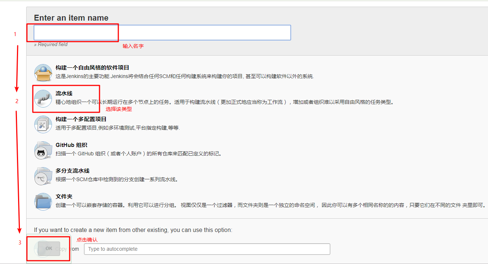
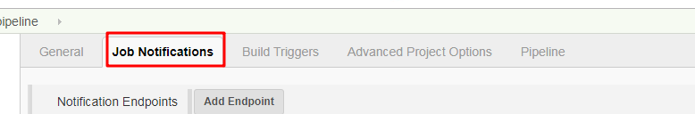
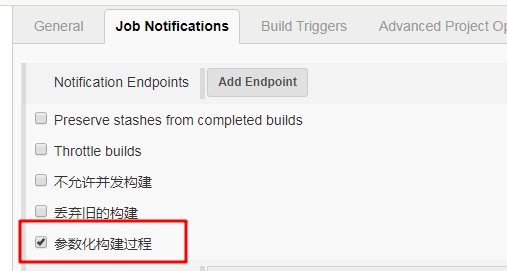
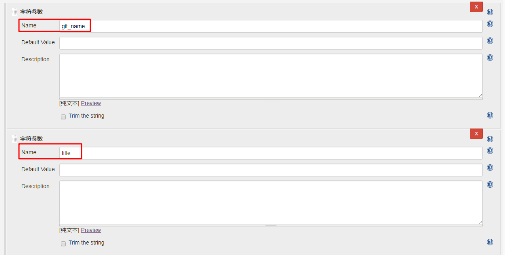
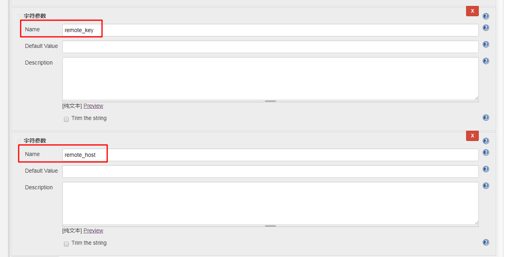
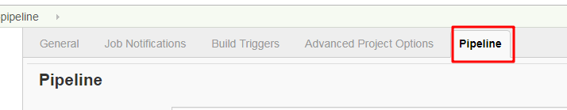
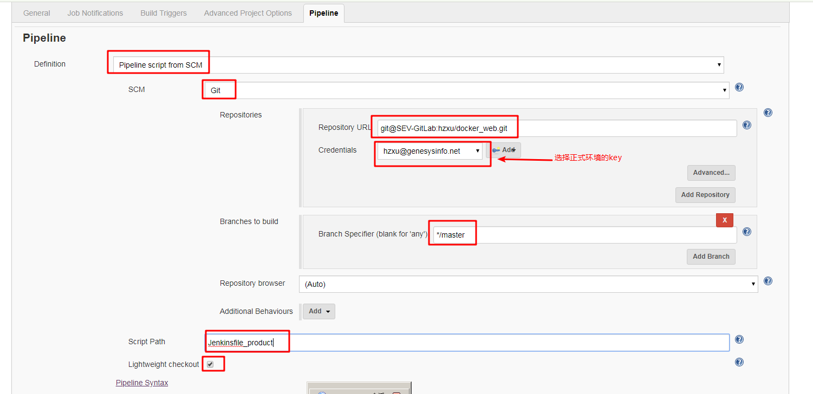

# 致远速联_web_docker_部署

## 概要
本文用于描述如何部署web_docker的部署

## 步骤
- 新建Jenkins的job，输入名字（自定义），选择pipeline类型（中文名字：流水线），点击创建

- 点击顶部的tab菜单：Job Notifications

- 勾选：参数化构建过程

- 选择 “ 字符参数 ”，分别添加四个参数：git_name, title, remote_key, remote_host

- 点击顶部的tab菜单：Pipeline

- 输入下图参数，点击保存

