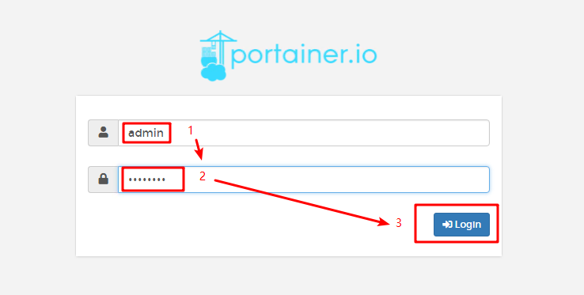

# 致远速联_测试服务器docker日志查看

## 概要
本文档用于描述：如何查看测试环境docker的日志

## 操作步骤
- 打开浏览器，输入网址
```
http://172.100.10.202:9000
```

- 输入账号和密码，点击登录
```
admin

12345678
```  


- 点击local节点


- 点击container


- 找到你的容器，并且点击旁边的日志按钮


- 上面为筛选条件，下面为日志内容


## 其他
- 说明：这个是一个用于查看和管理docker的一个可视化界面
- 仓库地址为：https://hub.docker.com/r/portainer/portainer
- 使用说明文档地址：https://portainer.readthedocs.io/en/stable/