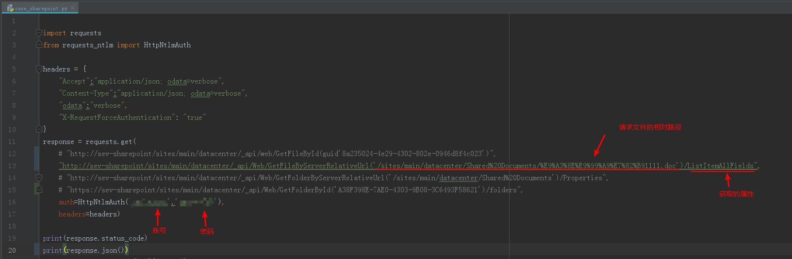
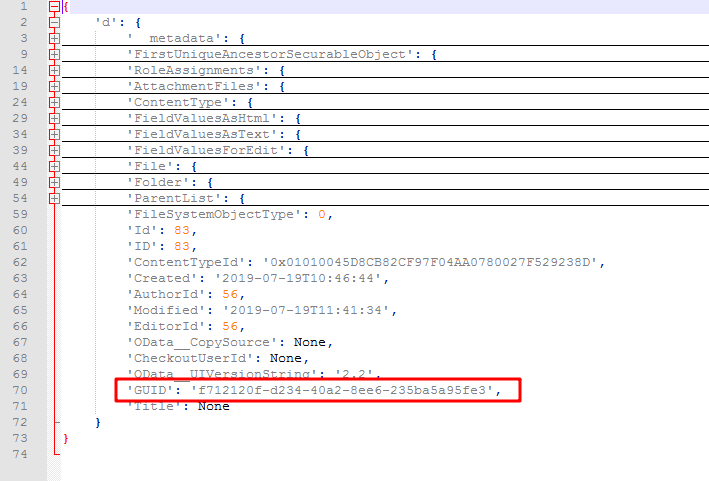

# 获取SharePoint文件的Guid

# 概要
本文用于描述如何通过 REST API 获取SharePoint文件的Guid

# 步骤
- 寻找SharePoint文件可以用来标识的id，发现了ETag，ContentTag，但是都不是用来作为唯一标识的
- 后面找到可以获取File的属性：ListItemAllFields，里面包含有GUID
- 代码：

- 获取到的内容就包含有GUID

# 其他
- 参考网址：
  - [Working with document Libraries based on UniqueID REST API
](https://sharepoint.stackexchange.com/questions/119202/working-with-document-libraries-based-on-uniqueid-rest-api)
  - [File properties](https://docs.microsoft.com/en-us/previous-versions/office/sharepoint-csom/ee542189(v%3Doffice.15))
  - [File.ListItemAllFields property](https://docs.microsoft.com/en-us/previous-versions/office/sharepoint-csom/ee539012%28v%3doffice.15%29)